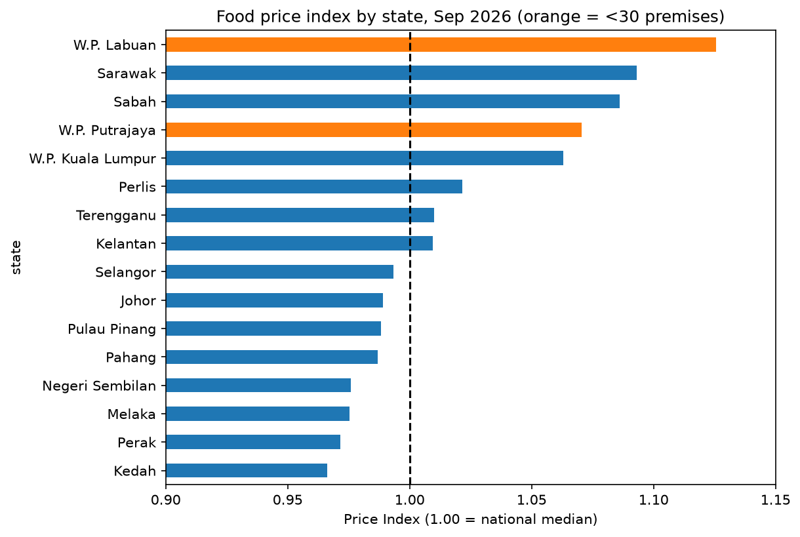

# Malaysia Food Price Analysis

How much do everyday food prices differ between Malaysian states? This project builds a **food price index by state** from the government's PriceCatcher survey, using September 2026 data.



## Key findings

- Across 181 everyday items priced in all 16 states and federal territories, most states are within a few percent of the national median price.
- **East Malaysia and the federal territories are the most expensive.** W.P. Labuan (index 1.13), Sarawak (1.09) and Sabah (1.09) sit highest, followed by W.P. Putrajaya (1.07) and W.P. Kuala Lumpur (1.06).
- **Kedah (0.97), Perak (0.97), Melaka (0.98) and Negeri Sembilan (0.98) are the cheapest.**
- Looking at one item can mislead. Johor had the cheapest Grade A eggs, but sits mid-table on the full index.

An index of 1.00 means prices match the national median; 1.05 means 5% above it.

> This analysis shows *where* prices are higher, not *why*. Explanations such as transport costs or urban rents are plausible but cannot be tested with this data.

## Data

- **PriceCatcher** (Ministry of Domestic Trade, via [data.gov.my](https://data.gov.my)): price records with date, premise code, item code and price (RM). This project uses the September 2026 file, which covers **1-24 September** (a partial month).
- **PriceCatcher Premise Lookup**: premise name, type, state and district.
- **PriceCatcher Item Lookup**: item name, unit, group and category.

The data files are not included in this repository because of their size. To reproduce the analysis, download all three files from the PriceCatcher pages on data.gov.my and save them in a `data/` folder as:

- `data/pricecatcher_2026-09.csv`
- `data/lookup_premise.csv`
- `data/lookup_item.csv`

## Method

1. **Merge** the price records with the premise and item lookup tables (left joins on `premise_code` and `item_code`). Row count was checked before and after to confirm no duplicates were introduced.
2. **Clean**: about 19,600 rows (1.4%) had item codes missing from the lookup table and were dropped.
3. **Filter to comparable items**: keep only the 181 items with prices in all 16 states and territories, so every state is compared on the same basket.
4. **Aggregate with medians**: one median price per item per state. Medians are used because the data contains extreme outliers (for example, a price of RM3,900).
5. **Benchmark**: the national price for each item is the median of the 16 state medians, so every state carries equal weight regardless of how many shops it has.
6. **Index**: divide each state's item price by the national price, then average those ratios across all 181 items. Using ratios puts cheap and expensive items on the same scale.

## Limitations

- **One partial month only.** Results describe early September 2026 and say nothing about trends over time.
- **Uneven sample sizes.** W.P. Labuan (15 premises) and W.P. Putrajaya (28) rest on far fewer shops than most states, which usually have 100+. They are shown in orange on the chart and should be read with caution.
- **Surveillance data.** PriceCatcher is a price-monitoring survey, not an official inflation measure, so it complements rather than replaces CPI data.
- **Equal item weights.** The index averages all 181 items equally, whereas a household budget would weight items by how much people actually spend on them.
- **Correlation only.** No causal claims are made about why prices differ.

## How to run

```powershell
git clone <your-repo-url>
cd malaysia-food-price-analysis
python -m venv .venv
.\.venv\Scripts\python.exe -m pip install -r requirements.txt
```

Download the data files into `data/` (see above), then open `notebooks/01_explore.ipynb` in VS Code or Jupyter and run all cells.

## Tools

Python, pandas, NumPy, Matplotlib, Seaborn, Jupyter.

## Possible next steps

- Add more months to look at seasonal changes (for example around festive periods).
- Compare against the DOSM Consumer Price Index for food.
- Weight items by household spending to build a more realistic index.
- Analyse district-level differences within states.
